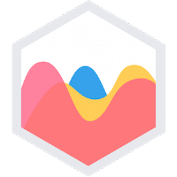

<!-- Project Info -->
<br>


<!-- Logo and link to repository -->
<p align="center">
  <a href="https://github.com/Pantonym/DV200-Term-1">
    
  </a>
</p>

<!-- Short Description -->
<h3 align="center">CrypTracker: API-Based Cryptocurrency Tracking Web Application</h3>
<p align="center"> This project aimed to create a website that displays data from a cryptocurrency api through Charts.js.
    <br>
    <!-- Bug and New Feature Links -->
    <a href="https://github.com/Pantonym/DV200-Term-1/issues">Report Bug</a>
    <a href="https://github.com/Pantonym/DV200-Term-1/issues">Request Feature</a>
    <br>
</p>

<!-- Name, Number, Subject and Term -->
<h5 align="center" style="padding:0;margin:0;">Nico van Wyk</h5>
<h5 align="center" style="padding:0;margin:0;">Student Number: 221179</h5>
<h6 align="center">DV200 | Term 1</h6>

<!-- TABLE OF CONTENTS -->
## Table of Contents

- [Table of Contents](#table-of-contents)
- [About the Project](#about-the-project)
  - [Mockup](#mockup)
  - [Project Description](#project-description)
    - [Technologies Used:](#technologies-used)
  - [Built With](#built-with)
    - [React.js](#reactjs)
    - [Chart.js](#chartjs)
    - [Axios](#axios)
    - [Bootstrap](#bootstrap)
- [Getting Started](#getting-started)
  - [Prerequisites](#prerequisites)
  - [Installation](#installation)
- [Features and Functionality](#features-and-functionality)
- [Development Process](#development-process)
  - [Architecture](#architecture)
  - [Theme](#theme)
  - [What was refined?](#what-was-refined)
    - [Previous Mockups](#previous-mockups)
  - [Development Documents](#development-documents)
  - [Highlights](#highlights)
  - [Challenges](#challenges)
  - [Future Implementation](#future-implementation)
- [Final Outcome](#final-outcome)
  - [Mockups](#mockups)
  - [Video Demonstration](#video-demonstration)
  - [Conclusion](#conclusion)
- [Contact](#contact)
- [License](#license)
- [Author](#author)
- [Acknowledgements](#acknowledgements)
- [References](#references)

<!-- About the Project -->
## About the Project

### Mockup
<p align="center"></p>

<!--PROJECT DESCRIPTION-->
### Project Description
The project concept was to create a web application that could compare data from an API and display it in editable charts. The outcome was the CrypTracker cryptocurrency tracking website that displays data both in text and chart format. It uses a timeline, line graph, bar charts and pie charts.
#### Technologies Used:
* JavaScript
* CSS
* HTML
* Figma

### Built With
<!-- React -->
#### React.js
* React focuses on using components to build user interfaces for both mobile and desktop. 
* It is open-source.
* It is a JavaScript library.
* It is owned by Meta, the owners of Facebook.
<p>React implemented the required charts and several other components, such as the Navbar.</p>


<!-- Chart.js -->
#### Chart.js
* Chart.js enables developers to implement charts, graphs and timelines into user experiences. 
* It is open-source.
* It is a JavaScript library.
<p>Chart.js implemented the requirements of having charts that compare and show data from an API.</p>


<!-- Axios & AJAX -->
#### Axios
* Makes Asynchronous JavaScript and XML (AJAX) easier to implement.
* It is a JavaScript library.
* Enables asynchronous requests.
* Used to implement Create, Read, Update and Delete (CRUD) functionality.
<p>AXIOS implemented the requirements of having charts populated with real data that can change asynchronously.</p>


<!-- Bootstrap -->
#### Bootstrap
* Provides CSS frameworks for the implementation of responsive user experience designs.
* Used to implement the front end of the application.
<p>Bootstrap implemented the requirements of having a responsive, professional design.</p>


<!-- GETTING STARTED -->
## Getting Started
These instructions will get you a copy of the project up and running on your local machine for development and testing purposes.

### Prerequisites
For development and testing, a React App is required (`Terminal --> New Terminal --> npx create-react-app appName`). This should download the most recent version of React.
The following statement is used to communicate with the CoinLore API: `https://api.coinlore.net/api/`

### Installation
Here are a couple of ways to clone this repo:

1.  GitHub Desktop </br>
    Enter `https://github.com/Pantonym/DV200-Term-1.git` into the URL field and press the `Clone` button.

2.  Clone Repository </br>
    Run the following in the command-line to clone the project:

    ```sh
    git clone https://github.com/Pantonym/DV200-Term-1.git
    ```

The following installations are required if you do not clone the repository:
* Click on Terminal and open a new terminal
* Type the following:
1. cd appName
2. npm i axios
3. npm i react-router-dom
4. npm i bootstrap react-bootstrap
5. npm i react-chartjs-2 chart.js
6. npm start
* To close the app: `ctrl+c`, `Y` in the terminal.

<!-- Main Features and Functionality -->
## Features and Functionality
1. Landing Dashboard - Display a summary of the properties of your sets using numbers.
* The data was gathered with an AXIOS call and set to a `useState`. Example:
`This dataset includes information about {TotalCoins} cryptocurrencies.`

2. Landing Dashboard - Summarise and contextualise the theme of your brief interpretation using different elements with descriptive text
* I used the top coin to create an element that displays both the summary of properties, as well as the brief interpretation. The top 4 coins were also displayed at the top of the landing page to help further contextualise the brief.
`<Card.Body className="Text_Left">`
`  <Card.Title className="Libre Card_Title Bold">{coinNames[2]}</Card.Title>`
`    <Card.Text className="Mulish Font_Body">USD: {coinPrices[2]}</Card.Text>`
`    <Card.Text className="Mulish Font_Body">{coinValue[2]} BTC</Card.Text>`
`    <Card.Text className="Mulish Font_Body">Current Rank: {coinRank[2]}</Card.Text>`
`</Card.Body>`

3. Comparison Page - Compare 2 objects from your data set
* The charts are populated using a useEffect. On many of the charts, three objects are compared, not just two.
`axios.get('https://api.coinlore.net/api/tickers/').then((response) => {`
`  setCoinDataPie({`
`    labels: [Found.name, found2p.name, found3p.name],`
`    datasets: [{`
`    label: 'Current Price in USD',`
`    data: [Found.price_usd, found2p.price_usd, found3p.price_usd], backgroundColor: ["#8134DF", "#34DFD5", "#DFCE34"]`
`}]})})`

4. Comparison Page - Object properties must be represented by 3 different ChartJS graphs
* The following graphs are used to display object properties:
`// --Bar Chart`
`  const [CoinDataBar, setCoinDataBar] = useState([]);`
`// --Pie Chart`
`  const [CoinDataPie, setCoinDataPie] = useState([]);`
`// --Radar Chart`
`  const [CoinDataRadar, setCoinDataRadar] = useState([]);`

5. Comparison Page - Change objects being compared
* An onChange event changes the useStates that are holding the graph data, forcing it to re-render with new data.
`<select onChange={(a) => {`
` let Coinrank = a.target.value - 1;`
` const Found = cryptos.find(obj => { return obj.rank === (Coinrank + 1) })`
` setFound3p(Found);`
` axios.get('https://api.coinlore.net/api/tickers/').then((response) => {`
`   setCoinDataPie({`
`     labels: [found1p.name, found2p.name, Found.name], Datasets: [{`
`       label: 'Current Price in USD',`
`       data: [found1p.price_usd, found2p.price_usd, Found.price_usd],`
`       backgroundColor: ["#8134DF", "#34DFD5", "#DFCE34"]`
`}]})})}}>`
` {Array.isArray(cryptos)`
`   ? cryptos.map((crypto) => {`
`   return <option key={crypto.id} value={crypto.rank}>{crypto.name}</option>;`
` })`
`: null}`
`</select>`

6. Timeline Page - Show a line graph
* The line graph is populated similar to the graphs in the Comparison page:
`setDataTime({`
`labels: [`
`  [arrDates[0] + ' hours (7 days)'],`
`  [arrDates[1] + ' hours'],`
`  [arrDates[2] + ' hour']`
`],`
`datasets: [{`
`  label: Found.name,`
`  data: [Found.percent_change_7d, Found.percent_change_24h, Found.percent_change_1h],`
`  backgroundColor: 'rgba(0, 247, 255, 1)',`
`  borderColor: 'rgba(0, 247, 255)',`
`  tension: 0.25`
`},{...},{...}]});`

7. Timeline Page - Be able to change characteristic being shown on line graph
* The data is changed in a similar way to the Comparison page:
`onChange={(a) => {...}`

8. Component Based Development - Show different components utilised in developing the project
* Each graph is made using its own component, as well as the footer and navbar.


9. Additional features and functionality
9.1 Loading Screen:
IsLoading, which is true by default, is only set to false at the end of the useEffect that assigns default values from the API on page load.
`if (isLoading === true) {`
` return <div style={{ background: '#000C24', height: '1044px', paddingBottom: '150px', display: 'flex', flexDirection: 'column' }}>`
` <p style={{ textAlign: 'center', paddingTop: '200px' }} className="Libre Font_Title Bold white"> Loading... </p>`
` </div>}`
No Else statement was needed, I simply had a second return below this one that would be displayed whenever isLoading would be set to false.

<!-- Development PROCESS -->
## Development Process
### Architecture
The application consists of multiple react components and pages.
### Theme
I chose a dark theme as it gives a modern feel to the website. It uses neon-like colours to evoke the technological aspect of cryptocurrency as a subject, also choosing a minimalist design to work with the modern theme. Each graph on the compare and timeline pages can be edited by choosing which currencies you want to display, and the landing page features a  description of the project as well as a dashboard with information on the recent top coins in the market. A more detailed description of Bitcoin is also available on this page.
### What was refined?
1. Collapsible Side Navbar was implemented
2. The cards displaying cryptocurrency information on the Landing Page was redesigned
3. The Comparison Page was updated according to the new style
4. The Timeline Page was updated according to the new style
5. The Readme File had a complete redesign to appear more professional and comprehensive.
6. New mockups were generated for the Readme File.
#### Previous Mockups


### Development Documents
<!-- Outline of Data Characteristics -->
* Outline of Data Characteristics


<!-- Wireframes -->
* Wireframes
Landing

Comparison

Timeline


<!-- Highlights -->
### Highlights
* It was very interesting to create code that automatically populates html tags with large amounts of data, as well as automatically assigning unique values to them for the higher functionality.
* Seeing the charts populate themselves and change based on input was a rewarding experience.
* Devising solutions to unique problems such as the page loading before charts have been populated.

<!-- Challenges -->
<!-- Explain the challenges faced with the project and why you think you faced it or how you think you'll solve it (if not solved), or how you solved it -->
### Challenges
* A major challenge was perspective. It was quite hard to visualize what the new code was going to do, especially the code that  automatically populates and creates html tags.
* Another problem was asynchronous code, such as the code that sets universal values.  Different methods of forcing the code to wait was created to ensure all the data loads.

<!-- Future Implementation -->
### Future Implementation
* In the future, more precise data would be added, such as data form CoinGecko. 
* More detail would also be given to the UI of the website to ensure it is of the highest quality. 

<!-- Final Outcome -->
## Final Outcome
<!-- MOCKUPS -->
### Mockups


<br>

<!-- VIDEO DEMONSTRATION -->
### Video Demonstration
**Video Demonstration:** <a href="https://drive.google.com/file/d/1j5DE8ROpJMiBFFriXdbgoGZ3GmUBYLKF/view?usp=sharing">Google Drive Link</a>

### Conclusion
In conclusion, I have created a website that acts as a dashboard for data from an API, which is displayed through charts created through Charts.js. I have learned how to create and use a react application, as well as how to implement and style charts with charts.js. I have also used Bootstrap inside of react for greater styling.

<!-- Contribution -->
<!-- Contact -->
## Contact
**Nico van Wyk** - [221179@virtualwindow.co.za](mailto:221179@virtualwindow.co.za)
* **Project Link** - https://github.com/Pantonym/DV200-Term-1

<!-- LICENSE -->
## License
Distributed under the MIT License. See `LICENSE` for more information.

<!-- AUTHORS -->
## Author
* **Nico van Wyk** - [Github](https://github.com/Pantonym)

<!-- ACKNOWLEDGEMENTS -->
<!-- all resources that you used and Acknowledgements here -->
## Acknowledgements
* [Lecturer](https://github.com/TsungaiKats)
* [Figma](https://www.figma.com/)
* [W3Schools](https://www.w3schools.com)

## References
* https://github.com/topics/react-ui (React Logo Image)
* https://github.com/chartjs (Chart.js Logo Image)
* https://www.geekboots.com/story/ajax-and-its-usability-in-web-development (AJAX Logo Image)
* https://blog.openreplay.com/integrating-axios-with-react-hooks/ (AXIOS Logo Image)
* https://tms-outsource.com/blog/posts/bootstrap-alternatives/ (Bootstrap Logo Image)